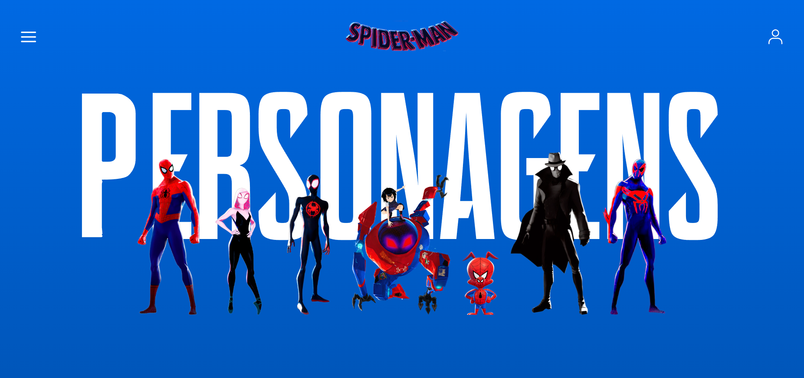
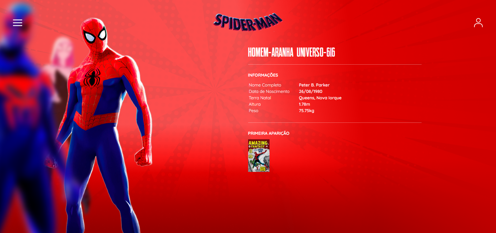

# Carousel Parallax do Aranhaverso

Projeto de criação de um carousel parallax animado utilizando nextjs com temática do aranhaverso e seus personagens.

A base do projeto é baseada no minicurso da [DIO](https://web.dio.me) e que pode ser acessado por esse [link](https://web.dio.me/lab/criando-um-carrossel-parallax-do-aranhaverso-com-react-nextjs-13-e-framer-motion/learning/b759ceb8-2fe3-4b14-b5bb-40416d831263)

## Funcionamento

Para executar no formato de desenvolvimento, utilize:

```bash
npm run dev
# ou
yarn dev
# ou
pnpm dev
# ou
bun dev
```

Para acessar a aplicação, vá até [http://localhost:3000](http://localhost:3000).

## Imagens




## Ferramentas


